# ADK Multi-Agent System with SurrealDB Memory

A collaborative multi-agent system built with Google's Agent Development Kit (ADK) that demonstrates persistent, graph-based memory using SurrealDB. The system features three agents that work together to research, analyze, and remember facts across sessions.

## Architecture

This system showcases how agents can build long-term memory and context:

- **Auditor Agent**: Coordinates the workflow and delegates tasks
- **Researcher Agent**: Gathers information via web search and stores findings in SurrealDB with embeddings
- **Analyst Agent**: Retrieves relevant past research from SurrealDB using semantic search and makes informed conclusions

All agent interactions, research findings, and decisions are persisted in SurrealDB's multi-model database, enabling:
- Graph relationships between agents and their work
- Vector search for semantic memory retrieval
- Document storage for research findings
- Time-series tracking of agent activities

## Agent Communication Flow

### Sequence Diagram: How Agents Interact

```mermaid
sequenceDiagram
    participant User
    participant Web as Web UI<br/>(Flask App)
    participant Auditor as 🎯 Auditor Agent<br/>(Coordinator)
    participant Researcher as 🔍 Researcher Agent<br/>(Information Gatherer)
    participant Analyst as 🧠 Analyst Agent<br/>(Analyzer)
    participant DB as SurrealDB<br/>(Multi-Model Memory)
    participant MCP as MCP Gateway<br/>(DuckDuckGo Search)
    participant Embed as Embedding Service<br/>(MiniLM-L6)

    Note over User,Embed: Query Processing Workflow
    
    User->>Web: Submit Query
    Web->>DB: Log query received
    Web->>Auditor: Process Query
    
    Note over Auditor: Step 1: Task Delegation
    Auditor->>DB: Log task delegation
    Auditor->>Researcher: Delegate research task
    
    Note over Researcher: Step 2: Web Search & Storage
    Researcher->>DB: Log search started
    Researcher->>MCP: Search web for query
    MCP-->>Researcher: Return search results
    
    Researcher->>Embed: Generate embedding (384 dims)
    Embed-->>Researcher: Return vector embedding
    
    Researcher->>DB: Store research + embedding
    DB-->>Researcher: Return research ID
    
    Researcher->>DB: Create collaboration edge<br/>(researcher->collaborated->analyst)
    Researcher->>DB: Log search completed
    
    Researcher-->>Auditor: Return research results
    
    Note over Analyst: Step 3: Memory Retrieval & Analysis
    Auditor->>Analyst: Analyze with memory
    Analyst->>DB: Log analysis started
    
    Analyst->>Embed: Generate query embedding
    Embed-->>Analyst: Return query vector
    
    Analyst->>DB: Semantic search<br/>(cosine similarity > 0.6)
    DB-->>Analyst: Return related research<br/>(with similarity scores)
    
    Analyst->>Analyst: Build conclusion<br/>(current + memory)
    Analyst->>DB: Store analysis in memory
    Analyst->>DB: Log analysis completed
    
    Analyst-->>Auditor: Return analysis + conclusion
    
    Note over Auditor: Step 4: Result Consolidation
    Auditor->>DB: Log task completed
    Auditor-->>Web: Return final response
    Web-->>User: Display results
```



### System Architecture

```mermaid
graph TB
    subgraph "User Interface Layer"
        USER["👤 User"]
        WEB["🌐 Web UI<br/>Flask on :8080"]
        SURREALIST["🖥️ Surrealist UI<br/>on :8081"]
    end
    
    subgraph "Agent Layer - Google ADK"
        AUDITOR["🎯 Auditor Agent<br/>Coordinator"]
        RESEARCHER["🔍 Researcher Agent<br/>Information Gatherer"]
        ANALYST["🧠 Analyst Agent<br/>Analyzer"]
    end
    
    subgraph "Data & Memory Layer"
        SURREALDB[("🗄️ SurrealDB<br/>Multi-Model Database")]
        
        subgraph "Database Tables"
            RESEARCH["📊 research<br/>- query<br/>- findings<br/>- embedding: 384 dims<br/>- confidence"]
            MEMORY["💾 agent_memory<br/>- topic<br/>- content<br/>- related_research"]
            ACTIVITY["📝 agent_activity<br/>- agent_id<br/>- action<br/>- details<br/>- timestamp"]
            COLLAB["🤝 collaborated<br/>Edge Table"]
            AGENT["🤖 agent<br/>- name<br/>- role<br/>- capabilities"]
            CONV["💬 conversation<br/>- session_id<br/>- role<br/>- content"]
        end
        
        VECTOR["🔢 Vector Index<br/>MTREE 384 dims"]
    end
    
    subgraph "External Services"
        MCP["🔌 MCP Gateway<br/>:8811"]
        DDG["🦆 DuckDuckGo<br/>Web Search"]
        EMBED["🧮 Embedding Model<br/>sentence-transformers<br/>MiniLM-L6-v2"]
        LLM["🤖 Qwen3 Model<br/>via Model Runner"]
    end
    
    %% User interactions
    USER -->|Query| WEB
    USER -->|View Data| SURREALIST
    WEB -->|Response| USER
    
    %% Agent orchestration
    WEB -->|1. Receive Query| AUDITOR
    AUDITOR -->|2. Delegate| RESEARCHER
    AUDITOR -->|4. Request Analysis| ANALYST
    RESEARCHER -->|3. Results| AUDITOR
    ANALYST -->|5. Conclusion| AUDITOR
    AUDITOR -->|6. Final Response| WEB
    
    %% Agent to Database
    AUDITOR <-->|Log Activities| ACTIVITY
    RESEARCHER <-->|Store Research| RESEARCH
    RESEARCHER <-->|Log Activities| ACTIVITY
    RESEARCHER -->|Create Edge| COLLAB
    ANALYST <-->|Semantic Search| RESEARCH
    ANALYST <-->|Store Analysis| MEMORY
    ANALYST <-->|Log Activities| ACTIVITY
    
    %% Database relationships
    SURREALDB --> RESEARCH
    SURREALDB --> MEMORY
    SURREALDB --> ACTIVITY
    SURREALDB --> COLLAB
    SURREALDB --> AGENT
    SURREALDB --> CONV
    RESEARCH --> VECTOR
    
    %% External service calls
    RESEARCHER -->|Search Query| MCP
    MCP -->|API Call| DDG
    DDG -->|Results| MCP
    MCP -->|Results| RESEARCHER
    
    RESEARCHER -->|Generate Embedding| EMBED
    ANALYST -->|Generate Embedding| EMBED
    EMBED -->|Vector 384d| RESEARCHER
    EMBED -->|Vector 384d| ANALYST
    
    AUDITOR <-->|Reasoning| LLM
    RESEARCHER <-->|Reasoning| LLM
    ANALYST <-->|Reasoning| LLM
    
    %% UI to Database
    SURREALIST <-->|Query/Visualize| SURREALDB
    
    %% Styling
    classDef agent fill:#4A90E2,stroke:#2E5C8A,stroke-width:2px,color:#fff
    classDef database fill:#50C878,stroke:#2D7A4A,stroke-width:3px,color:#fff
    classDef service fill:#FF6B6B,stroke:#C92A2A,stroke-width:2px,color:#fff
    classDef ui fill:#9B59B6,stroke:#6C3483,stroke-width:2px,color:#fff
    
    class AUDITOR,RESEARCHER,ANALYST agent
    class SURREALDB,RESEARCH,MEMORY,ACTIVITY,COLLAB,AGENT,CONV,VECTOR database
    class MCP,DDG,EMBED,LLM service
    class USER,WEB,SURREALIST ui
```



### Agent Collaboration Graph


### Communication Patterns

#### 1. **Delegation Pattern**
- **Auditor** receives query → delegates to **Researcher**
- Logged in `agent_activity` table for tracking

#### 2. **Research & Storage Pattern**
- **Researcher** performs web search via MCP Gateway
- Generates 384-dimensional embedding using MiniLM-L6-v2
- Stores findings + embedding in SurrealDB
- Creates graph edge: `researcher->collaborated->analyst`

#### 3. **Semantic Memory Retrieval**
- **Analyst** generates query embedding
- Performs vector similarity search (cosine > 0.6)
- Retrieves related past research automatically
- Builds context-aware conclusions

#### 4. **Collaboration Tracking**
- Graph edges track agent collaboration
- Topics and timestamps recorded
- Enables analysis of agent teamwork patterns

#### 5. **Activity Logging**
- All agent actions logged to `agent_activity`
- Timestamped for complete audit trail
- Supports debugging and optimization

### SurrealDB Multi-Model Usage

| Model Type | Usage in System |
|------------|----------------|
| **Document** | Store research findings, agent memory |
| **Graph** | Track agent collaboration relationships |
| **Vector** | Semantic search via cosine similarity |
| **Time-Series** | Activity tracking with timestamps |
| **Relational** | Agent definitions, conversation history |

## Prerequisites

- **Docker Desktop 4.43.0+ or Docker Engine** installed
- **A laptop or workstation with a GPU** (e.g., a MacBook) for running open models locally
  - If you don't have a GPU, you can use **Docker Offload**
- **Docker Compose 2.38.1+** (if using Docker Engine on Linux)

## Quick Start

1. **Navigate to this directory**
   ```bash
   cd surrealdb-agentic-compose
   ```

2. **Create MCP environment file**
   ```bash
   cp mcp.env.example .mcp.env
   # Edit .mcp.env and add your API keys if needed
   ```

3. **Start the system**
   ```bash
   docker compose up --build
   ```

4. **Access the web interface**
   Open http://localhost:8080 in your browser to interact with the agents

5. **View SurrealDB data**
   - Access Surrealist: http://localhost:8081
   - Or use CLI:
     ```bash
     docker compose exec surrealdb surreal sql --ns agents --db memory --user root --pass root
     ```

## Using OpenAI Models

To use OpenAI instead of local models:

1. **Create OpenAI API key file**
   ```bash
   echo "sk-your-api-key-here" > secret.openai-api-key
   ```

2. **Start with OpenAI configuration**
   ```bash
   docker compose -f compose.yaml -f compose.openai.yaml up --build
   ```

## Example Interactions

Try these queries to see the memory system in action:

1. **First query**: "What are the latest trends in containerization?"
   - Researcher will search and store findings in SurrealDB
   
2. **Related query**: "How does Docker Compose help with microservices?"
   - Analyst will find related past research via semantic search
   - Response will reference previous containerization research

3. **Follow-up**: "What did we learn about containers earlier?"
   - System retrieves conversation history from SurrealDB

## Project Structure

```
surrealdb-agentic-compose/
├── compose.yaml              # Main Docker Compose configuration
├── compose.openai.yaml       # OpenAI model override
├── compose.offload.yaml      # Docker Offload configuration
├── mcp.env.example           # MCP environment template
├── Dockerfile                # Agent application container
├── requirements.txt          # Python dependencies
├── init.surql               # SurrealDB schema initialization
├── README.md                 # This file
└── src/
    ├── app.py               # Main application with web UI
    ├── agents.py            # ADK agent definitions
    ├── surrealdb_client.py  # SurrealDB connection and operations
    └── embeddings.py        # Embedding generation utilities
```

## Key Features

### 1. Persistent Agent Memory
Agents remember past research across sessions, building knowledge over time.

### 2. Semantic Search
Uses vector embeddings to find related past research, even if keywords don't match.

### 3. Graph Relationships
Tracks which agents collaborated on which topics, enabling insight into agent teamwork.

### 4. Time-Series Analysis
All activities are timestamped, allowing analysis of how agent knowledge evolves.

## Technology Stack

- **Agent Framework**: Google ADK (Agent Development Kit)
- **Database**: SurrealDB v2.x (multi-model with vector support)
- **MCP Gateway**: Docker MCP Gateway (Model Context Protocol)
- **Search**: DuckDuckGo via MCP server
- **Embeddings**: sentence-transformers/all-MiniLM-L6-v2 (384 dimensions)
- **LLM**: Qwen3 (local via Docker Model Runner) or OpenAI (optional)
- **Web UI**: Flask (Python)
- **Container Orchestration**: Docker Compose

## How It Works

1. **User submits a query** via the web interface (http://localhost:8080)

2. **Auditor Agent** receives the query and:
   - Logs the query in SurrealDB
   - Delegates research task to Researcher Agent

3. **Researcher Agent**:
   - Searches the web using MCP Gateway (DuckDuckGo)
   - Generates a 384-dimensional embedding of the findings
   - Stores research + embedding in SurrealDB's `research` table
   - Creates a collaboration edge: `researcher->collaborated->analyst`

4. **Analyst Agent**:
   - Generates an embedding for the user's query
   - Performs semantic search in SurrealDB (cosine similarity > 0.6)
   - Finds related past research automatically
   - Builds a conclusion combining current research + relevant memory
   - Stores the analysis in `agent_memory` table

5. **Auditor Agent**:
   - Consolidates the results
   - Returns the final response to the user

6. **Memory Persists**: All research, embeddings, and agent activities remain in SurrealDB for future queries!

### Example: Building Knowledge Over Time

**First Query**: "What are the latest trends in containerization?"
- Researcher searches and stores findings with embedding
- Analyst has no prior knowledge, so uses only current research
- Result stored in SurrealDB

**Second Query**: "How does Docker Compose help with microservices?"
- Researcher searches and stores new findings
- Analyst performs semantic search and finds the previous "containerization" research
- Response includes both current info AND relevant past context
- Users see: "Based on current research and our previous discussion about containerization..."

This is the power of **persistent agent memory**! 🧠

## License

This example follows the dual-license of the compose-for-agents repository:
Apache-2.0 OR MIT
